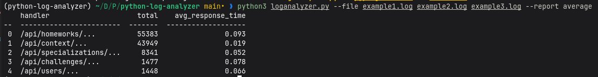

# python-log-analyzer
<a id="readme-top"></a>

<div align="center">
  <p align="center">
    Настраиваемая быстрая утилита для анализа логов.
    <br />
    <a href="https://alexeev-prog.github.io/python-log-analyzer/"><strong>Explore the docs »</strong></a>
    <br />
    <br />
    <a href="#-getting-started">Getting Started</a>
    ·
    <a href="#-usage-examples">Basic Usage</a>
    ·
    <a href="https://alexeev-prog.github.io/python-log-analyzer/">Documentation</a>
    ·
    <a href="https://github.com/alexeev-prog/python-log-analyzer/blob/main/LICENSE">License</a>
  </p>
</div>
<br>
<p align="center">
    
    
    
    
    
    
    
</p>
<p align="center">
    
</p>



## Установка

```bash
git clone https://github.com/alexeev-prog/python-log-analyzer
cd python-log-analyzer
python3 -m venv venv
source ./venv/bin/activate # Linux bash
pip install tabulate
```

## Запуск

```bash
python3 loganalyzer -h
```

```
usage: loganalyzer.py [-h] --file FILE [FILE ...] --report REPORT [--date DATE] [--user-agent USER_AGENT] [--fileformat FILEFORMAT]

Python Log Analyzer

options:
  -h, --help            show this help message and exit
  --file FILE [FILE ...]
                        provide a file(s) for analyze
  --report REPORT       provide a report type
  --date DATE           provide a date filter (%Y-%m-%d)
  --user-agent USER_AGENT
                        provide a user agent filter
  --fileformat FILEFORMAT
                        provide a fileformat (log or json)
```

## Пример использования
В качестве файлов используются примеры логов из репозитория, которые вы сами можете попробовать.

## Стратегия "average"
Сортировка по URL (handler) с подсчетом общего количества (total) и среднего времени ответа (avg_response_time).

```bash
 $ python3 loganalyzer.py --file example1.log example2.log example3.log --report average

    handler                     total    avg_response_time
--  ------------------------  -------  -------------------
 0  /api/homeworks/...          55383                0.093
 1  /api/context/...            43949                0.019
 2  /api/specializations/...     8341                0.052
 3  /api/challenges/...          1477                0.078
 4  /api/users/...               1448                0.066
```

Также можно составить статистику по дате (в формате `%Y-%m-%d`):

```bash
 $ python3 loganalyzer.py --file example1.log example2.log example3.log --report average --date 2025-06-22

    handler                     total    avg_response_time
--  ------------------------  -------  -------------------
 0  /api/homeworks/...           3592                0.097
 1  /api/context/...             2585                0.023
 2  /api/specializations/...      576                0.055
 3  /api/users/...                102                0.07
 4  /api/challenges/...           102                0.087
```

И по user-agent:

```bash
 $ python3 loganalyzer.py --file example1.log example2.log example3.log --report average --user-agent "Example User Agent"

    handler                     total    avg_response_time
--  ------------------------  -------  -------------------
 0  /api/homeworks/...             71                0.158
 1  /api/context/...               21                0.043
 2  /api/specializations/...        6                0.035
 3  /api/users/...                  1                0.072
 4  /api/challenges/...             1                0.056
```

## Стратегия "user_agent"
Выявление самых популярных User-Agent'ов.

```bash
 $ python3 loganalyzer.py --file example1.log example2.log example3.log --report user_agent

    user_agent            total
--  ------------------  -------
 0  ...                  110498
 1  Example User Agent      100
```

Также можно составить статистику по дате (в формате `%Y-%m-%d`):

```bash
 $ python3 loganalyzer.py --file example1.log example2.log example3.log --report user_agent --date 2025-06-22

    user_agent            total
--  ------------------  -------
 0  ...                    6857
 1  Example User Agent      100
```

И по user-agent:

```bash
 $ python3 loganalyzer.py --file example1.log example2.log example3.log --report user_agent --user-agent "Example User Agent"

    user_agent            total
--  ------------------  -------
 0  Example User Agent      100
```

---

По умолчанию файлы логов обрабатываются по следующей модели:

```json
{"@timestamp": "2025-06-22T13:59:47+00:00", "status": 200, "url": "/api/homeworks/...", "request_method": "GET", "response_time": 0.032, "http_user_agent": "..."}
{"@timestamp": "2025-06-22T13:59:47+00:00", "status": 200, "url": "/api/homeworks/...", "request_method": "GET", "response_time": 0.068, "http_user_agent": "..."}
```

В таком случае идет загрузка каждой строки отдельно (ибо каждая строка - отдельный JSON объект).

Но при `--fileformat json` можно загружать json-файлы:

```json
[
	{"@timestamp": "2025-06-22T13:57:32+00:00", "status": 200, "url": "/api/context/...", "request_method": "GET", "response_time": 0.024, "http_user_agent": "Example User Agent"},
	{"@timestamp": "2025-06-22T13:57:32+00:00", "status": 200, "url": "/api/context/...", "request_method": "GET", "response_time": 0.02, "http_user_agent": "Example User Agent"}
]
```

Здесь они являются уже списком словарей и обрабатываются целым файлом.

## Использование

 + `--file`: перечисление файлов через пробел (`--file example1.log example2.log`)
 + `--report`: тип репорта. Поддерживается average и user_agent.
 + `--date`: фильтровать по дате (формат `%Y-%m-%d`).
 + `--user-agent`: фильтровать по user-agent (http_user_agent).
 + `--fileformat`: фильтровать по формату файла (`log` или `json`, по умолчанию `log`).

## Архитектура
Для генерации отчетов используется паттерн "Стратегия", что гарантирует минимальное вмешательство при добавлении новых видов отчета:

```python
class ReportStrategy(ABC):
    """Report strategy class."""

    @abstractmethod
    def generate_report(self, data: list[dict[str, any]]) -> list[dict[str, any]]:
        """
        Generate data with used strategy.

        Args:
            data (list[dict[str, any]]): data.

        Returns:
            list[dict[str, any]]

        """
        raise NotImplementedError
```

Также в ReportManager помимо списка данных и стратегии репорта есть список функций-фильтров. Фильтрация позволяет отсечь ненужные данные, например по дате или User-Agent.

```python
def create_user_agent_filter(target_user_agent: str) -> callable:
    """Create date filter for reports manager."""

    def filter_func(entry):
        user_agent = entry["http_user_agent"]
        return user_agent == target_user_agent

    return filter_func


def create_date_filter(target_date_str: str) -> callable:
    """Create date filter for reports manager."""

    def filter_func(entry):
        entry_date = datetime.strptime(
            entry["@timestamp"], "%Y-%m-%dT%H:%M:%S%z"
        ).date()
        target_date = datetime.strptime(  # noqa: DTZ007
            target_date_str,
            "%Y-%m-%d",
        ).date()
        return entry_date == target_date

    return filter_func
```

После этого мы просто передаем в ReportManager через аргумент filters нужные нам функции: `filters=[create_user_agent_filter("...")]`. В данном примере - создаем функцию-фильтр для подсчета всех элементов с определенным User-Agent.

Данная архитектура понятная и расширяемая.

## Политика продукта
Основная политика - относительно строгие правила линтера, zero warnings, и high coverage (80-100 %).
